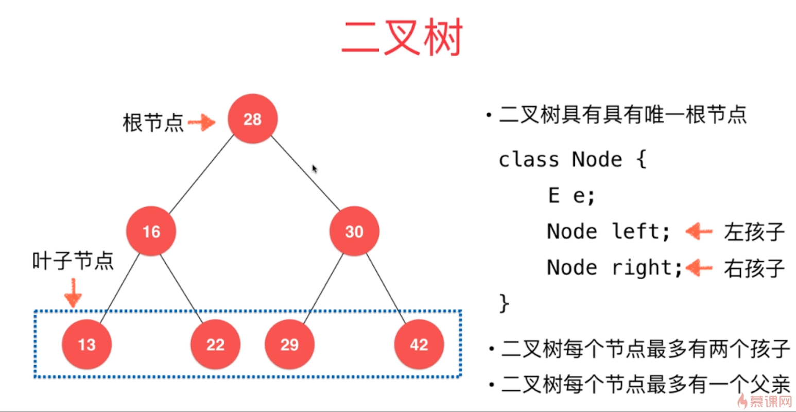
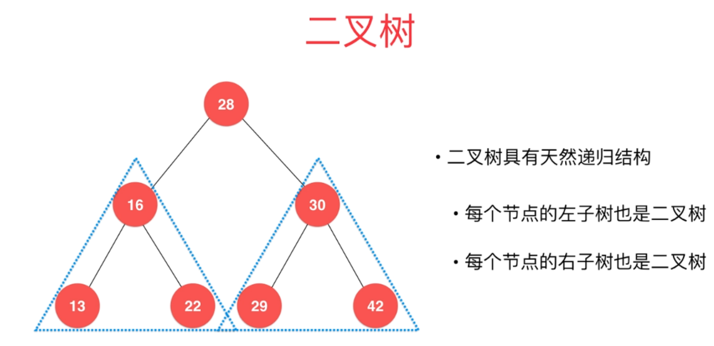
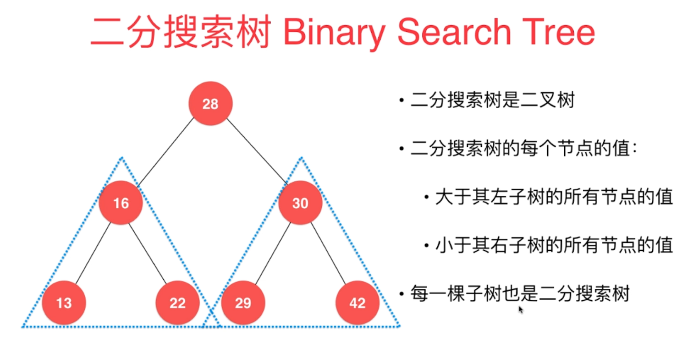

# 树 Tree

## 二叉树

+ 二叉树是一种动态数据结构
+ 二叉树具有唯一根节点，每个节点最多有两个子节点，一个父节点

``` Java
class Node {
	E e;
	Node left;		//左孩子
	Node right;		//右孩子
}
```



+ 二叉树具有天然递归结构
   + 每个节点的左子树也是二叉树
   + 每个节点的右子树也是二叉树



+ 二叉树不一定是满的

***

## 二分搜索树 Binary Search Tree

+ 二分搜索树是二叉树，每一棵子树也是二分搜索树

+ 二分搜索树的每个节点的值：
   + 大于其左子树所有节点的值
   + 小于其右子树所有节点的值



+ 存储的元素必须有**可比较性**

### 二分搜索树添加新元素

+ 注：这里实现的二分搜索树是不包含重复元素的。
  + 如果想包含重复元素，只需要定义：
  + 左子树小于等于节点，或右子树大于等于节点。

二分搜索树添加新元素的非递归写法，和链表很相似


